# 🌐 Supply Chain Management Portfolio
* * *
> 🚀 Examining sophisticated tactics and resolutions in the field of supply chain management

## Course Information
- *Course Name:* Algorithmic Problem Solving
- *Course Code:* 23ECSE309
- *Course Instructor:* Prakash Hegade

## Personal Information
- *Name:* Sameer M Nadaf
- *USN:* 01FE21BCI352
- *University:* KLE Technological University, Hubli

## Table of Contents
- [📖 Introduction](#introduction)
- [🌟 Why Supply Chain Management?](#why-supply-chain-management)
- [📚 Literature Survey on Supply Chain Management](#literature-survey-on-supply-chain-management)
- [🎯 Objective](#objective)
- [💼 Use Cases](#use-cases)
- [📜 References](#references)

## Introduction
Welcome to my portfolio, where I present my learnings and insights about Supply Chain Management (SCM). Through this portfolio, I aim to demonstrate my understanding of major SCM concepts, tactics, and their applicability in solving real-world situations.

## Why Supply Chain Management?

Supply Chain Management intrigues me due to its vital function in ensuring the smooth movement of goods and services from suppliers to customers. The complexity of managing and optimizing supply chains, along with the influence on corporate efficiency and customer happiness, fuels my interest for this sector. My goal is to employ advanced SCM solutions to boost operational performance and generate innovation.

## Literature Survey on Supply Chain Management

### Introduction
Supply chain management (SCM) is the active management of supply chain activities to optimize customer value and achieve a sustainable competitive advantage. It involves the design, planning, execution, control, and monitoring of supply chain activities with the purpose of creating net value, constructing a competitive infrastructure, utilizing worldwide logistics, synchronizing supply with demand, and measuring performance globally.

### Key Themes in Supply Chain Management

#### Globalization and Supply Chains

- *Trend:* The extension of global supply networks to harness cost advantages and access into new markets.
- *Statistics:* According to the DHL Global Connectedness Index, global trade, capital, information, and people flows are at an all-time high, with global trade reaching over $19 trillion in 2023.
- *Reference:* DHL Global Connectedness Index 2023.

#### Technology and Digital Transformation

- *Trend:* The integration of sophisticated technologies such as the Internet of Things (IoT), artificial intelligence (AI), and blockchain in supply chain processes.
- *Statistics:* Gartner forecasts that 50% of global product-centric organizations will have invested in real-time transportation visibility technologies by 2024.
- *Reference:* Gartner, "Predicts 2023: Supply Chain Technology," 2023.

#### Sustainability and Green Supply Chains
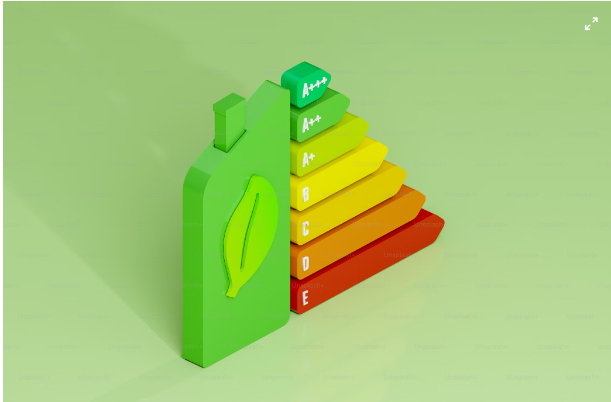
- *Trend:* Increasing emphasis on sustainability and ecologically friendly methods throughout supply networks.
- *Statistics:* The Carbon Disclosure Project (CDP) discovered that supply chains account for up to 5.5 times higher emissions than a company's direct operations.
- *Reference:* Carbon Disclosure Project, "Supply Chain Report," 2023.

#### Risk Management and Resilience

- *Trend:* Focus on establishing resilient supply chains that can survive interruptions.
- *Statistics:* A McKinsey analysis reveals that supply chain interruptions cost organizations, on average, 45% of one year’s profits over the course of a decade.
- *Reference:* McKinsey & Company, "Risk, resilience, and rebalancing in global value chains," 2023.
  
#### Data Analytics and Supply Chain Visibility
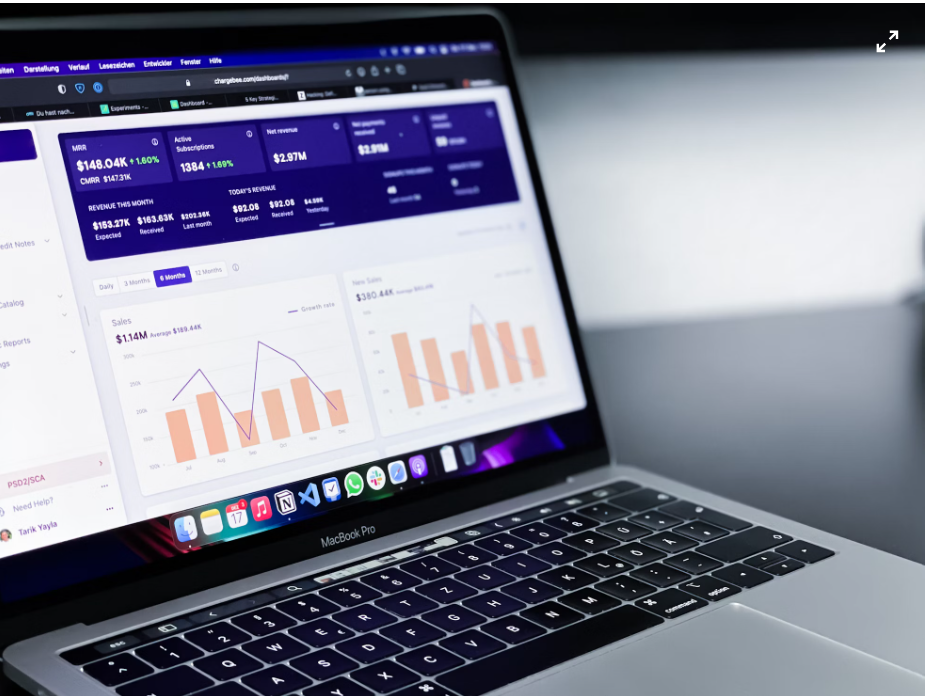
- *Trend:* Leveraging big data and analytics to increase supply chain visibility and decision-making.
- *Statistics:* According to a survey by Deloitte, 79% of companies with high-performing supply chains report revenue growth well above the industry average.
- *Reference:* Deloitte, "The path to supply chain agility," 2023.

### Significant Developments and Innovations

#### Blockchain for Transparency

- *Development:* Use of blockchain technology to promote transparency and traceability in supply networks.
- *Example:* Walmart and IBM's Food Trust blockchain initiative has significantly reduced the time it takes to trace the origin of food from days to seconds.
- *Reference:* Walmart, IBM Food Trust Case Study, 2023.

#### AI and Machine Learning

- *Development:* Implementation of AI and machine learning for demand forecasting, inventory management, and predictive maintenance.
- *Example:* Amazon uses machine learning algorithms to optimize its vast logistics network, resulting in a 25% reduction in fulfillment costs.
- *Reference:* Amazon, "2023 Annual Report," 2023.
  
#### IoT for Real-time Monitoring

- *Development:* Deployment of IoT devices for real-time monitoring of commodities, boosting supply chain visibility.
- *Example:* Maersk's Remote Container Management system leverages IoT to monitor the condition of refrigerated containers in transit.
- *Reference:* Maersk, "Remote Container Management," 2023.

## Objective
The major purpose of this portfolio is to illustrate my understanding and use of SCM principles to address real-world difficulties and optimize supply chain operations.

## Use Cases

### 1. 📦 Demand Forecasting and Inventory Management

#### USE CASE:
Accurate demand forecasting and effective inventory management are vital for balancing supply and demand. Techniques such as Time Series Analysis, Regression Analysis, and Dynamic Programming are utilized to estimate demand and optimize inventory levels.

#### CHALLENGES:
- *Predicting demand accurately* in the face of changing market conditions, seasonal variations, and unexpected events.
- *Balancing inventory levels* to avoid overstocking, which ties up capital and incurs storage costs, or stockouts, which can lead to lost sales and customer dissatisfaction.
- *Integrating forecasting models* with inventory management systems for real-time adjustments and decision-making.

#### STRATEGIES USED:

1. *Time Series Analysis*:
   - *Description*: This method involves analyzing historical data to identify patterns and trends over time, such as seasonality, cycles, and irregular variations.
   - *Application*: By applying time series analysis, businesses can predict future demand based on past demand patterns. For example, if a retailer sees a spike in sales every December, they can forecast higher demand during this period and adjust their inventory accordingly.
   - *Benefits*: Helps in anticipating demand fluctuations and making informed decisions on inventory levels, ensuring that the right amount of stock is available when needed.

2. *Regression Analysis*:
   - *Description*: Regression analysis examines the relationship between a dependent variable (e.g., demand) and one or more independent variables (e.g., price, season, economic indicators).
   - *Application*: By understanding how factors like price changes, promotional activities, or economic conditions impact demand, businesses can create more accurate demand forecasts. For instance, a regression model might reveal that a 10% discount leads to a 15% increase in demand.
   - *Benefits*: Provides insights into how different factors influence demand, enabling more precise and actionable forecasting.

3. *Dynamic Programming*:
   - *Subset Sum Problem*:
     - *Description*: This problem involves finding a subset of numbers that sum to a specific value, which can be applied to inventory management to determine the optimal combination of products to stock.
     - *Application*: Helps in deciding the mix of inventory that meets demand while minimizing costs. For example, a company might use this approach to select the best combination of raw materials to keep in stock.
     - *Benefits*: Ensures that inventory is optimized to meet demand without excess, reducing storage costs and capital tied up in stock.
   - *Coin Combinations*:
     - *Description*: This problem focuses on finding different ways to combine coins to achieve a specific amount, useful for managing currency in inventory systems.
     - *Application*: Applied to scenarios like cash register management or vending machines, where it's important to have the right denominations available.
     - *Benefits*: Enhances the efficiency of currency handling and ensures that the right change is always available.
   - *Rod Cutting Problem*:
     - *Description*: Involves determining the best way to cut a rod into pieces to maximize profit, relevant for optimizing stock lengths in manufacturing.
     - *Application*: Manufacturers can use this strategy to decide how to cut raw materials to minimize waste and maximize usable output.
     - *Benefits*: Reduces material wastage and increases the efficiency of the manufacturing process.
   - *Longest Common Subsequence*:
     - *Description*: This problem identifies the longest sequence that can be derived from two sequences, useful for finding common patterns in demand sequences.
     - *Application*: Helps in recognizing recurring demand patterns across different time periods or product lines, aiding in better demand forecasting.
     - *Benefits*: Enhances the accuracy of demand predictions by identifying and leveraging common demand patterns.

### CODE REFERENCES
- [Subset Sum Problem](./codes/1.md)
- [Coin Combinations](./codes/2.md)
- [Rod Cutting Problem](./codes/3.md)
- [Longest Common Subsequence](./codes/4.md)

### 2. 🚚 *Logistics and Transportation Optimization*

#### USE CASE:
Optimizing logistics and transportation involves controlling routes, decreasing costs, and enhancing delivery efficiency. Algorithms such as Dijkstra's Shortest Path, Vehicle Routing Problem (VRP), and Tree Structures are used to enhance logistics operations.

#### CHALLENGES:
- **Balancing cost reduction with service level improvements**: Ensuring that logistics operations are cost-effective while maintaining high service quality.
- **Handling dynamic changes in routes and transportation requirements**: Adapting to real-time changes such as traffic conditions, delivery time windows, and unexpected delays.
- **Integrating logistics optimization with real-time data for adaptive decision-making**: Using real-time data to make informed and timely decisions to optimize logistics operations.

#### STRATEGIES USED:

1. **Dijkstra's Shortest Path Algorithm**:
   
   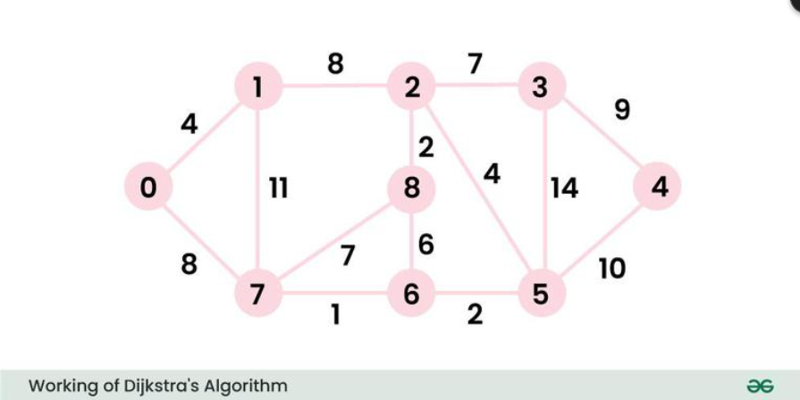
   - **Description**: This algorithm finds the shortest path between nodes in a graph, which can represent locations and routes in a logistics network.
   - **Application**: Used to determine the most efficient routes for transportation, minimizing travel time and distance. For example, it can help a delivery company find the quickest route from the warehouse to the delivery point.
   - **Benefits**: Reduces travel costs and delivery times, improving overall logistics efficiency and customer satisfaction.

3. **Vehicle Routing Problem (VRP)**:

   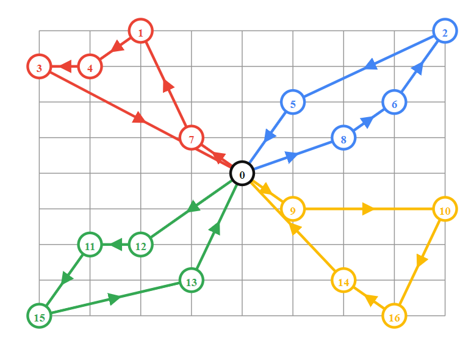
   - **Description**: VRP involves determining the optimal set of routes for a fleet of vehicles delivering to a set of locations, taking into account various constraints such as vehicle capacity and delivery time windows.
   - **Application**: Helps logistics companies plan efficient delivery routes that minimize total travel distance and time while meeting delivery constraints. For example, it can optimize the routes for a fleet of trucks delivering goods to multiple customers.
   - **Benefits**: Enhances route planning efficiency, reduces fuel consumption, lowers operational costs, and ensures timely deliveries.

5. **Tree Structures**:
   - **AVL Trees and Red-Black Trees**:
     
    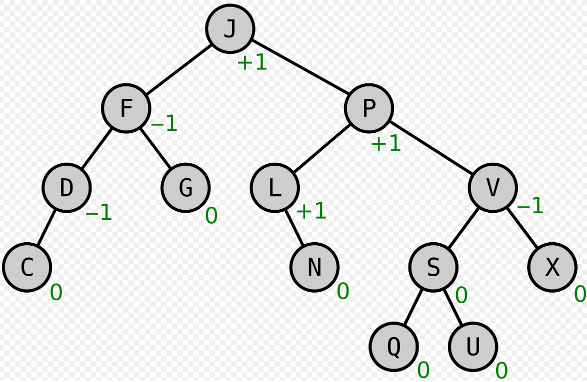
     - **Description**: These are types of self-balancing binary search trees that maintain sorted data, allowing for efficient data storage and retrieval.
     - **Application**: Used for storing and retrieving route information, ensuring quick access to route data and facilitating efficient route optimization. For instance, a logistics system can quickly find and update the best routes using these tree structures.
     - **Benefits**: Ensures fast and efficient access to route data, improving the responsiveness of logistics systems to dynamic changes.
   - **Heap Implementation**:

   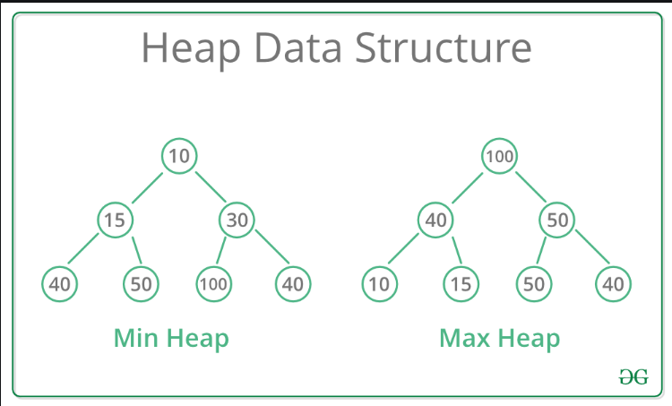
     - **Description**: Heaps are a type of tree-based data structure that can function as a priority queue, where the highest (or lowest) priority element is always at the root.
     - **Application**: Used for managing delivery schedules by prioritizing deliveries based on urgency, distance, or other criteria. For example, a delivery system can prioritize urgent deliveries by placing them higher in the heap.
     - **Benefits**: Improves the efficiency of delivery scheduling, ensuring that the most critical deliveries are handled promptly.

### CODE REFERENCES
- [Dijkstra's Shortest Path Algorithm](./codes/5.md)
- [Vehicle Routing Problem (VRP)](./codes/6.md)
- [AVL Trees and Red-Black Trees](./codes/7.md)
- [Heap Implementation](./codes/8.md)

### 3. 🔄 *Supplier Relationship Management*

#### USE CASE:
Managing supplier relationships entails reviewing supplier performance, negotiating terms, and ensuring compliance. Techniques such as Supplier Scorecards, Contract Management Systems, and Mathematical Algorithms are utilized for better supplier management.

#### CHALLENGES:
- **Maintaining good relationships while negotiating favorable conditions**: Balancing the need to build strong, collaborative relationships with suppliers while also securing favorable terms and conditions.
- **Evaluating and managing supplier risks**: Identifying, assessing, and mitigating risks associated with suppliers to ensure a stable supply chain.
- **Ensuring compliance with contract terms and performance metrics**: Monitoring and ensuring suppliers meet their contractual obligations and performance expectations.

#### STRATEGIES USED:

1. **Supplier Scorecards**:
   - **Description**: Supplier scorecards are tools used to evaluate and track supplier performance based on key performance indicators (KPIs) such as quality, delivery, cost, and service.
   - **Application**: By regularly reviewing supplier scorecards, companies can identify high-performing suppliers, spot areas for improvement, and make informed decisions about supplier relationships. For example, a scorecard might show that a supplier consistently delivers late, prompting a review of the relationship.
   - **Benefits**: Provides a structured approach to monitoring supplier performance, ensuring suppliers meet the company's standards and contributing to overall supply chain efficiency.

2. **Contract Management Systems**:
   - **Description**: These systems are software tools designed to manage and track contract creation, execution, and compliance, ensuring all parties meet their contractual obligations.
   - **Application**: Contract management systems can automate contract tracking, alerting businesses to upcoming renewals, compliance issues, or performance deviations. For instance, a system might notify a company of an approaching contract renewal date, allowing ample time for renegotiation.
   - **Benefits**: Enhances contract compliance, reduces administrative workload, and ensures that all contractual terms are met, thereby minimizing legal and operational risks.

3. **Mathematical Algorithms**:
   - **Fermat's Little Theorem**:
  
     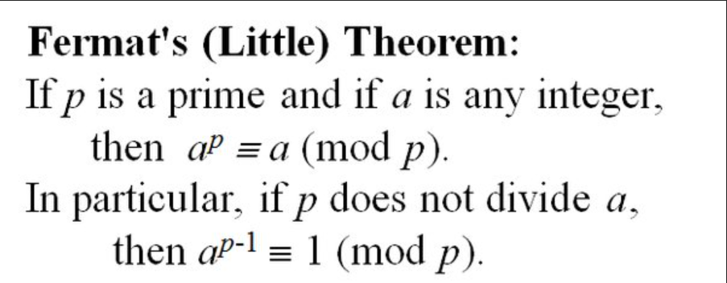
     - **Description**: This theorem is used in number theory and has applications in cryptography, providing secure communication channels.
     - **Application**: In supplier relationship management, cryptographic techniques based on Fermat's Little Theorem can secure sensitive communications, such as contract negotiations and performance data exchanges, ensuring confidentiality and integrity.
     - **Benefits**: Enhances the security of communications with suppliers, protecting sensitive information from unauthorized access.
   - **Catalan Numbers**:
  
     
     - **Description**: Catalan numbers are a sequence of natural numbers that have applications in combinatorial mathematics.
     - **Application**: These numbers can be used to solve combinatorial optimization problems related to supplier selection and scheduling. For example, they can help determine the optimal combination of suppliers to meet varying demand scenarios.
     - **Benefits**: Improves decision-making in supplier selection and resource allocation, leading to a more efficient and resilient supply chain.
   - **Pascal's Triangle and Fibonacci Series**:
  
     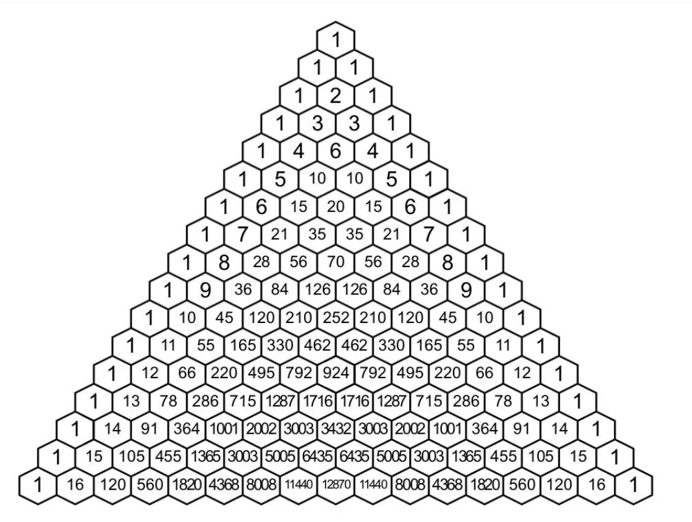
     - **Description**: Pascal's Triangle is a triangular array of binomial coefficients, while the Fibonacci series is a sequence where each number is the sum of the two preceding ones.
     - **Application**: These mathematical constructs can be applied to financial forecasting and inventory replenishment cycles. For instance, Fibonacci series might be used to model demand cycles, aiding in predicting future inventory needs.
     - **Benefits**: Enhances financial and inventory planning, ensuring that resources are allocated efficiently and inventory levels are optimized to meet demand.

### CODE REFERENCES
- [Fermat's Little Theorem](./codes/9.md)
- [Catalan Numbers](./codes/10.md)
- [Pascal's Triangle and Fibonacci Series](./codes/44.md)

### 4. 📈 *Supply Chain Analytics*

#### USE CASE:
Supply chain analytics involves evaluating data to gain insights and drive decision-making. Techniques such as Descriptive Analytics, Predictive Analytics, and Query Range Problems are used to improve supply chain visibility and performance.

#### CHALLENGES:
- **Handling and analyzing enormous amounts of supply chain data**: Managing vast quantities of data generated across the supply chain and extracting meaningful insights.
- **Integrating analytics with operational processes for useful insights**: Ensuring that analytical findings are seamlessly integrated into day-to-day operations to drive improvements.
- **Ensuring data accuracy and relevance for successful decision-making**: Maintaining high data quality and relevance to make well-informed decisions.

#### STRATEGIES USED:

1. **Descriptive Analytics**:
   - **Description**: Descriptive analytics involves analyzing historical data to understand past performance and identify trends and patterns.
   - **Application**: By using descriptive analytics, businesses can gain insights into key performance metrics such as order fulfillment rates, delivery times, and inventory levels. For example, analyzing past sales data can help identify seasonal trends and adjust inventory accordingly.
   - **Benefits**: Provides a clear understanding of what has happened in the past, helping businesses make informed decisions based on historical performance.

2. **Predictive Analytics**:
   - **Description**: Predictive analytics uses statistical models and machine learning algorithms to forecast future trends and outcomes based on historical data.
   - **Application**: Businesses can use predictive analytics to anticipate demand fluctuations, identify potential supply chain disruptions, and optimize inventory levels. For instance, predictive models can forecast future sales volumes, allowing for better inventory planning and reduced stockouts.
   - **Benefits**: Enhances decision-making by providing foresight into future events, enabling proactive management of the supply chain.

3. **Query Range Problems**:
   - **Fenwick Tree / Binary Indexed Tree (BIT)**:
  
     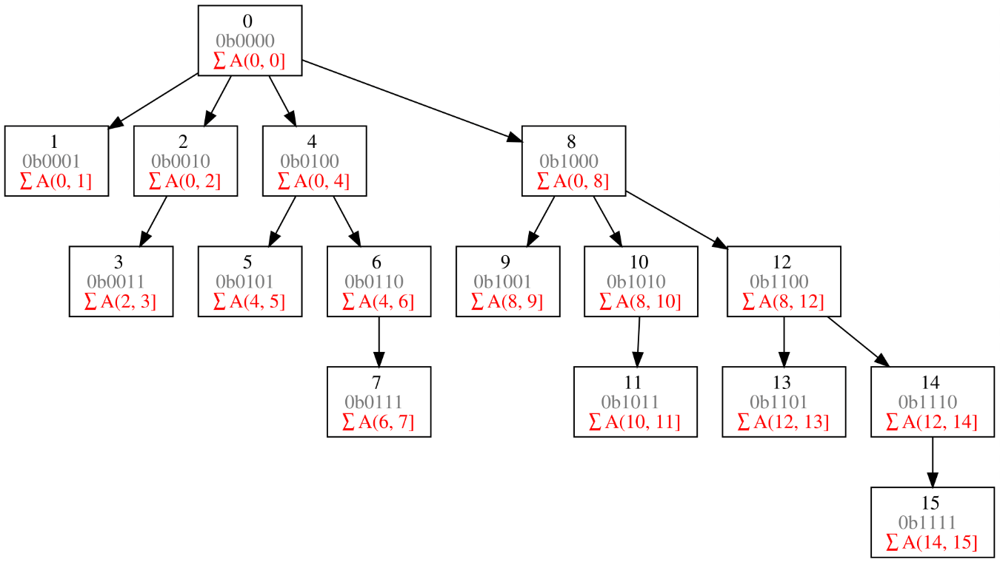
     - **Description**: A Fenwick Tree or BIT is a data structure that provides efficient methods for cumulative frequency tables and range sum queries.
     - **Application**: In supply chain analytics, BIT can be used for efficient range queries and updates in inventory systems, such as quickly calculating the total inventory in a range of bins or updating inventory levels.
     - **Benefits**: Improves the efficiency of inventory management operations, allowing for quick and accurate data retrieval and updates.
   - **Segment Trees**:
     - **Description**: Segment trees are data structures that allow for fast querying and updating of intervals or segments within an array.
     - **Application**: Used for interval queries and range minimum/maximum operations, segment trees can help in scenarios like quickly finding the minimum stock level in a range of warehouses or the maximum sales in a region.
     - **Benefits**: Provides quick access to range data, improving the responsiveness and accuracy of supply chain analysis.
   - **Kadane's Algorithm**:
     - **Description**: Kadane's algorithm is used to find the maximum sum of a contiguous subarray within a one-dimensional numeric array, useful in financial and economic analyses.
     - **Application**: In supply chain analytics, Kadane's algorithm can identify periods of maximum profit or minimum loss, helping in financial analysis and decision-making.
     - **Benefits**: Assists in identifying the most profitable or least costly periods, supporting better financial planning and analysis.

### CODE REFERENCES
- [Fenwick Tree / BIT](./codes/12.md)
- [Segment Trees](./codes/13.md)
- [Kadane's Algorithm](./codes/14.md)

### 5. 🔒 *Supply Chain Risk Management*

#### USE CASE:
Managing supply chain risks involves recognizing, assessing, and managing potential disruptions that could impact the supply chain. Techniques such as Risk Assessment Frameworks, Scenario Planning, and Graph Algorithms are used to improve risk management and ensure continuity.

#### CHALLENGES:
- **Identifying and assessing a wide range of potential risks**: Detecting various types of risks, including operational, financial, and geopolitical risks, and evaluating their potential impact on the supply chain.
- **Developing effective contingency plans**: Creating and implementing strategies to address and mitigate the effects of identified risks and ensure continuity during disruptions.
- **Balancing risk minimization with operational efficiency**: Ensuring that risk management measures do not excessively disrupt normal operations or reduce efficiency.

#### STRATEGIES USED:

1. **Risk Assessment Frameworks**:
   - **Description**: Risk assessment frameworks provide systematic methods for identifying, evaluating, and prioritizing risks based on their likelihood and potential impact.
   - **Application**: These frameworks help organizations assess various risk factors, such as supplier reliability, geopolitical instability, and financial volatility. For example, a risk assessment framework might be used to evaluate the impact of a natural disaster on supply chain operations and prioritize mitigation efforts.
   - **Benefits**: Offers a structured approach to risk identification and evaluation, enabling organizations to prioritize risks and allocate resources effectively to manage them.

2. **Scenario Planning**:
   - **Description**: Scenario planning involves developing and analyzing multiple hypothetical scenarios to prepare for potential disruptions and their impacts.
   - **Application**: Businesses use scenario planning to model different risk scenarios, such as supply chain interruptions due to geopolitical events or natural disasters, and develop response strategies. For example, a company might create scenarios for varying levels of supplier disruption and plan corresponding contingency measures.
   - **Benefits**: Enhances preparedness by exploring various possible outcomes and developing strategies to address each scenario, improving the organization's ability to respond to unexpected events.

3. **Graph Algorithms**:
   - **Ford-Fulkerson Algorithm**:
  
     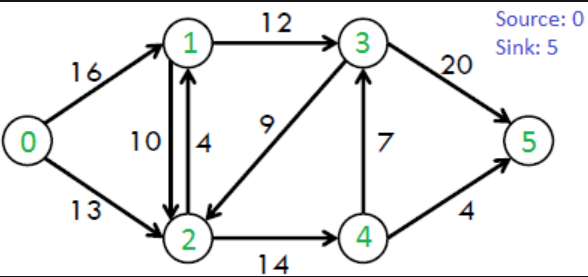
     - **Description**: The Ford-Fulkerson algorithm is used to solve the maximum flow problem in flow networks, which can be applied to supply chain logistics to determine the maximum possible flow through a network.
     - **Application**: In supply chain risk management, this algorithm helps in identifying bottlenecks and optimizing the flow of goods and resources through the supply chain network. For example, it can be used to ensure that critical supply routes have sufficient capacity to handle peak loads.
     - **Benefits**: Improves network efficiency by identifying and addressing bottlenecks, ensuring smooth flow of resources and minimizing disruptions.
   - **Union-Find Algorithms**:
  
     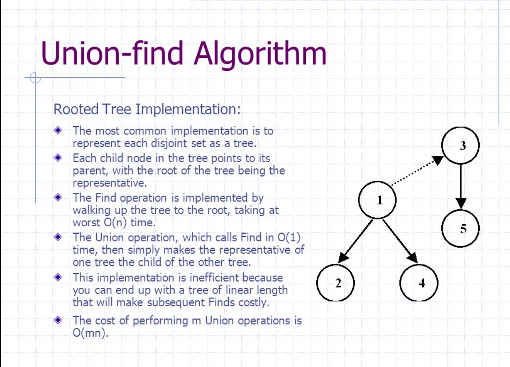
     - **Description**: Union-Find algorithms are used for clustering and managing disjoint sets, helping to analyze the connectivity and reliability of networks.
     - **Application**: These algorithms can be used to assess the reliability and connectivity of supply chain networks, such as determining how clusters of suppliers are connected and identifying potential vulnerabilities. For example, Union-Find algorithms can help in managing and analyzing supplier networks to assess risk concentrations and interdependencies.
     - **Benefits**: Enhances network reliability and resilience by identifying clusters and potential points of failure, allowing for better management of network risks.

### CODE REFERENCES
- [Ford-Fulkerson Algorithm](./codes/15.md)
- [Union-Find Algorithms](./codes/16.md)

### 6. 🌍 *Sustainable Supply Chain Management*

#### USE CASE:
Implementing sustainable practices in supply chain management focuses on reducing environmental impact and promoting social responsibility. Techniques like Green Logistics, Circular Economy Models, and various principles are utilized to advance sustainability in supply chains.

#### CHALLENGES:
- **Balancing sustainability goals with cost and operational efficiency**: Integrating sustainable practices without significantly increasing costs or disrupting operational efficiency.
- **Implementing and monitoring sustainable practices across the supply chain**: Ensuring that all suppliers and partners adhere to sustainability standards and practices.
- **Ensuring compliance with environmental legislation and standards**: Adhering to regulatory requirements and industry standards related to environmental and social responsibility.

#### STRATEGIES USED:

1. **Green Logistics**:
   - **Description**: Green logistics involves implementing practices that minimize the environmental impact of logistics activities, including transportation, warehousing, and distribution.
   - **Application**: Strategies include optimizing transportation routes to reduce fuel consumption, using energy-efficient warehouse practices, and employing eco-friendly packaging materials. For example, companies might use electric vehicles for delivery or adopt smart routing systems to reduce emissions.
   - **Benefits**: Reduces carbon footprint, lowers environmental impact, and can lead to cost savings through improved operational efficiency.

2. **Circular Economy Models**:
   - **Description**: Circular economy models focus on designing systems that promote recycling, reuse, and resource efficiency, aiming to create a closed-loop system where waste is minimized.
   - **Application**: Implementing circular economy practices involves designing products for durability and ease of recycling, setting up take-back programs, and reusing materials within the supply chain. For instance, a company might establish a program to return used products for refurbishment and resale.
   - **Benefits**: Reduces waste, conserves resources, and minimizes environmental impact by promoting resource efficiency and recycling.

3. **Principles**:
   - **Lazy Propagation**:
     - **Description**: Lazy propagation is a technique used in data structures to delay updates until they are needed, improving efficiency in certain scenarios.
     - **Application**: In sustainable supply chain management, lazy propagation can be used to manage and update logistics and inventory systems efficiently. For example, it can help optimize inventory levels by delaying updates until necessary, reducing unnecessary processing and resource usage.
     - **Benefits**: Enhances efficiency in data management and reduces computational overhead, supporting more sustainable operational practices.
   - **Sliding Window**:
     - **Description**: The sliding window technique is used to optimize resource usage and manage data in a sequential manner, often to solve problems related to continuous data streams.
     - **Application**: In supply chain management, sliding window techniques can be used to monitor and optimize resource usage over time, such as managing inventory levels or analyzing consumption patterns. For example, it can help in dynamically adjusting inventory based on recent demand trends.
     - **Benefits**: Improves resource management and reduces waste by providing a more accurate view of current resource needs and usage.
   - **Copy on Write**:
     - **Description**: Copy on write is a technique used in data management where modifications are made to a copy of the data rather than the original, ensuring efficient data management and minimizing duplication.
     - **Application**: This principle can be applied in inventory and logistics systems to efficiently manage and track changes without duplicating data. For instance, it can help in maintaining up-to-date inventory records while minimizing storage requirements.
     - **Benefits**: Ensures efficient data management and reduces resource duplication, contributing to more sustainable data practices.

### CODE REFERENCES
- [Lazy Propagation](./codes/17.md)
- [Sliding Window](./codes/18.md)
- [Copy on Write](./codes/19.md)

### 7. 🚀 *Warehouse Management System Implementation*

#### USE CASE:
Developing and installing a Warehouse Management System (WMS) aims to streamline warehouse operations, increase inventory accuracy, and boost order fulfillment efficiency.

#### CHALLENGES:
- **Ensuring smooth connection with existing systems**: Integrating the new WMS with current systems such as Enterprise Resource Planning (ERP) or Transportation Management Systems (TMS).
- **Training staff to use the new system efficiently**: Ensuring that warehouse staff are adequately trained to use the new WMS to maximize its benefits.
- **Maintaining data accuracy and real-time visibility of inventory**: Ensuring that inventory data is accurate and updated in real-time to support efficient warehouse operations.

#### STRATEGIES USED:

1. **AVL Trees**:
   - **Description**: AVL trees are self-balancing binary search trees that provide efficient database indexing and retrieval operations by maintaining a balanced structure.
   - **Application**: In a WMS, AVL trees can be used for indexing and quickly retrieving information from the database, such as product locations and inventory levels. For example, AVL trees can help in managing the database of warehouse items to quickly find the location of any item in the warehouse.
   - **Benefits**: Enhances database performance by providing fast search, insert, and delete operations, which improves overall efficiency in managing warehouse inventory.

2. **Dynamic Programming**:
   - **Stolen Value Problem**:
     - **Description**: The Stolen Value Problem, a variation of the knapsack problem, is used to optimize storage space and resource allocation by determining the best way to allocate limited resources.
     - **Application**: In a warehouse, dynamic programming can help optimize storage space by determining the best way to allocate items to different storage locations to maximize space utilization. For example, it can assist in organizing products to minimize wasted space and ensure efficient use of available storage.
     - **Benefits**: Optimizes resource allocation and storage efficiency, leading to better space utilization and reduced operational costs.

3. **Graph Algorithms**:
   - **Depth-First Search (DFS) and Breadth-First Search (BFS)**:
  
   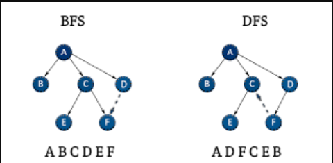
     - **Description**: DFS and BFS are graph traversal algorithms used to explore nodes and edges in a graph.
     - **Application**: In a WMS, DFS and BFS can be used for efficient pathfinding and order picking. For example, DFS can help in finding the path to retrieve an item in a complex warehouse layout, while BFS can be used to find the shortest path for order picking and optimizing picking routes.
     - **Benefits**: Improves efficiency in pathfinding and order picking processes, leading to faster and more accurate fulfillment of warehouse orders.

### CODE REFERENCES
- [AVL Trees](./codes/7.md)
- [Stolen Value Problem](./codes/20.md)
- [DFS and BFS](./codes/21.md)

### 8. 📊 *Sales and Operations Planning (S&OP)*

#### USE CASE:
Implementing Sales and Operations Planning (S&OP) processes aims to align production and distribution activities with sales forecasts to achieve an optimal balance between supply and demand. This process ensures that resources are effectively allocated and inventory levels are managed to meet customer needs while minimizing excess.

#### CHALLENGES:
- **Achieving cross-functional collaboration**: Coordinating efforts between sales, production, and distribution teams to ensure that everyone is aligned with the overall S&OP plan.
- **Balancing supply with shifting demand**: Adapting production and inventory strategies to respond to changes in demand forecasts and market conditions.
- **Ensuring data accuracy and timely updates**: Maintaining accurate and up-to-date data to support reliable forecasting and planning decisions.

#### STRATEGIES USED:

1. **Time Series Analysis**:
   - **Description**: Time series analysis involves examining historical data points collected over time to identify trends, cycles, and seasonal patterns, which can be used to forecast future demand.
   - **Application**: In S&OP, time series analysis is used to predict future sales based on historical sales data. For instance, analyzing past sales data for a product to forecast future demand helps in planning production and inventory levels.
   - **Benefits**: Provides accurate demand forecasts by identifying and utilizing patterns in historical data, improving inventory management and production planning.

2. **Pascal's Triangle**:
   - **Description**: Pascal's Triangle is a mathematical construct used to represent binomial coefficients and solve combinatorial problems.
   - **Application**: In decision-making within S&OP, Pascal's Triangle can be used for combinatorial analysis to evaluate different scenarios and decision options. For example, it can help in calculating various combinations of production and distribution strategies to find the most efficient approach.
   - **Benefits**: Facilitates complex decision-making by providing insights into various combinations and permutations, aiding in optimizing S&OP processes.

3. **Scenario Planning**:
   - **Description**: Scenario planning involves developing and analyzing multiple potential scenarios to prepare for various future conditions and uncertainties.
   - **Application**: In S&OP, scenario planning helps in preparing for different operational scenarios, such as changes in market demand, supply disruptions, or production capacity issues. For example, creating scenarios for high, medium, and low demand can guide decision-making and contingency planning.
   - **Benefits**: Enhances preparedness by evaluating different possible futures and developing strategies to address each scenario, improving flexibility and responsiveness in S&OP.

### CODE REFERENCES
- [Pascal's Triangle](./codes/44.md)
- [Scenario Planning](./codes/22.md)

### 9. 🏭 *Manufacturing Resource Planning (MRP)*

#### USE CASE:
Manufacturing Resource Planning (MRP) focuses on optimizing manufacturing resources and scheduling to ensure timely production while minimizing costs and maximizing efficiency. It involves managing inventory levels, production schedules, and resource allocation to meet demand effectively.

#### CHALLENGES:
- **Balancing inventory levels with manufacturing schedules**: Ensuring that inventory levels align with production schedules to avoid overstocking or stockouts.
- **Minimizing production downtime**: Reducing interruptions in production to maintain efficiency and meet delivery deadlines.
- **Integrating MRP with other supply chain activities**: Coordinating MRP with other functions like procurement, logistics, and sales to streamline operations.

#### STRATEGIES USED:

1. **Dynamic Programming**:
   - **Rod Cutting Max Product**:
     - **Description**: The Rod Cutting Max Product problem is a variant of the rod cutting problem, where the goal is to maximize the product of the lengths of pieces cut from a rod, given certain constraints.
     - **Application**: In MRP, dynamic programming can be used to optimize the allocation of manufacturing resources, such as determining the best way to cut raw materials into pieces to maximize their utility. For example, it can help in scheduling the production of various products to maximize the overall output.
     - **Benefits**: Improves resource utilization and efficiency by providing optimal solutions for resource allocation and production planning.

2. **Heap Implementation**:
   - **Description**: Heap implementation involves using a data structure (heap) to manage priority queues efficiently. Heaps allow for quick access to the highest (or lowest) priority element.
   - **Application**: In MRP, heaps can be used for efficient scheduling and priority management. For instance, scheduling tasks based on their priority, such as handling urgent production orders before others, can help in managing production resources effectively.
   - **Benefits**: Enhances scheduling efficiency and priority management, leading to more streamlined production processes and reduced downtime.

3. **Binomial Coefficients**:
   - **Description**: Binomial coefficients are used in combinatorics to calculate the number of ways to choose a subset of items from a larger set. They are also used in various optimization problems.
   - **Application**: In MRP, binomial coefficients can be used for production planning and lot sizing, such as determining the optimal lot size for manufacturing runs based on production constraints and demand forecasts. For example, calculating the number of ways to batch production orders to minimize setup times and costs.
   - **Benefits**: Supports effective production planning and lot sizing, leading to cost savings and improved resource utilization.

### CODE REFERENCES
- [Rod Cutting Max Product](./codes/23.md)
- [Heap Implementation](./codes/8.md)
- [Binomial Coefficients](./codes/24.md)

### 10. 💡 *Innovation and Technology Adoption*

#### USE CASE:
Evaluating and deploying new technologies such as Internet of Things (IoT), Artificial Intelligence (AI), and blockchain to enhance supply chain visibility, efficiency, and security. This involves identifying the most suitable technologies and integrating them into existing systems to drive innovation and improve overall performance.

#### CHALLENGES:
- **Assessing the ROI of new technology**: Evaluating the return on investment to determine the financial and operational benefits of adopting new technologies.
- **Ensuring smooth integration with existing systems**: Integrating new technologies with current systems and processes without causing disruptions or inefficiencies.
- **Training staff to use new technologies effectively**: Providing adequate training to ensure that employees can effectively utilize new technologies and maximize their benefits.

#### STRATEGIES USED:

1. **A* Search**:
   - **Best First Search**:
     - **Description**: Best First Search is an informed search algorithm that explores paths in a search space based on a heuristic to find an optimal solution.
     - **Application**: In the context of technology adoption, Best First Search can be used to explore and evaluate different technology solutions by assessing their potential benefits and alignment with organizational goals. For example, it can help in selecting the best technology for improving supply chain visibility based on specific criteria.
     - **Benefits**: Helps in identifying optimal technology solutions by focusing on promising options and reducing the search space, leading to more informed decision-making.
   - **A* with Priority Queue**:
     - **Description**: A* Search with a priority queue combines heuristic-based search with a priority queue to efficiently explore paths and make decisions.
     - **Application**: This strategy can be used for project prioritization and resource allocation in technology adoption. For instance, it can help prioritize technology projects based on factors like potential impact, cost, and implementation complexity.
     - **Benefits**: Enhances decision-making by prioritizing projects and allocating resources effectively, ensuring that the most valuable technologies are implemented first.

2. **Dynamic Programming**:
   - **Edit Distance Problem**:
     - **Description**: The Edit Distance Problem measures the minimum number of operations (insertions, deletions, or substitutions) required to transform one string into another. It is used for comparing and selecting the best options among alternatives.
     - **Application**: In technology adoption, dynamic programming can be applied to compare and select the best technology options by evaluating the differences between various technologies and their fit with existing systems. For example, it can help in determining how well a new technology integrates with current processes compared to alternatives.
     - **Benefits**: Provides a systematic approach to comparing technology options and selecting the most suitable one based on compatibility and benefits, leading to better technology adoption decisions.

### CODE REFERENCES
- [Best First Search](./codes/25.md)
- [A* with Priority Queue](./codes/25.md)
- [Edit Distance Problem](./codes/26.md)

### 11. 💻 *E-Commerce Supply Chain Management*

#### USE CASE:
Managing supply chain operations for e-commerce enterprises involves ensuring effective order processing, inventory management, and delivery. This encompasses handling large volumes of orders and returns, optimizing fulfillment processes, and integrating multi-channel inventory systems.

#### CHALLENGES:
- **Handling huge order quantities and returns**: Managing a high volume of orders and processing returns efficiently to maintain customer satisfaction and operational efficiency.
- **Ensuring fast and accurate order fulfillment**: Meeting customer expectations for quick and accurate delivery of orders.
- **Managing multi-channel inventories**: Coordinating inventory across various sales channels (e.g., online store, physical stores) to avoid stockouts and overstocking.

#### STRATEGIES USED:

1. **Dynamic Programming**:
   - **Minimum Number of Jumps**:
     - **Description**: The Minimum Number of Jumps problem involves finding the minimum number of jumps required to reach the end of an array where each element represents the maximum number of jumps that can be made from that position.
     - **Application**: In e-commerce supply chain management, dynamic programming can be used to optimize delivery routes and minimize the total delivery time. For example, it can help in determining the most efficient route for a delivery truck to take, considering various constraints and delivery points.
     - **Benefits**: Optimizes delivery routes by reducing travel time and costs, improving overall efficiency in order fulfillment.

2. **Heap Implementation**:
   - **Description**: Heap implementation involves using a data structure that supports efficient priority management and retrieval operations.
   - **Application**: In e-commerce order processing, heaps can be used for managing priorities, such as prioritizing urgent orders or handling high-priority customers. For instance, orders can be managed using a priority queue to ensure that urgent orders are processed and shipped first.
   - **Benefits**: Enhances order processing efficiency by effectively managing priorities and ensuring timely fulfillment of high-priority orders.

3. **Graph Algorithms**:
   - **Kruskal's Implementation**:
     - **Description**: Kruskal's algorithm is used to find the Minimum Spanning Tree (MST) of a graph, which helps in optimizing network connectivity and reducing costs.
     - **Application**: In e-commerce supply chain management, Kruskal's algorithm can be applied to optimize logistics networks and reduce transportation costs. For example, it can help in designing an efficient delivery network by minimizing the total cost of connecting various warehouses and distribution centers.
     - **Benefits**: Reduces logistics and transportation costs by optimizing network design and connectivity, leading to more efficient supply chain operations.

### CODE REFERENCES
- [Minimum Number of Jumps](./codes/27.md)
- [Heap Implementation](./codes/8.md)
- [Kruskal's Implementation](./codes/28.md)

### 12. 🌐 *Global Supply Chain Management*

#### USE CASE:
Global Supply Chain Management involves coordinating supply chain activities across multiple countries. This includes managing logistics, customs, and regulatory compliance to ensure smooth operations and timely delivery of goods.

#### CHALLENGES:
- **Handling varied rules and trade policies**: Navigating different regulations, tariffs, and trade policies in various countries can complicate global supply chain operations.
- **Managing extended lead times and freight costs**: Dealing with longer shipping times and higher costs associated with international transportation.
- **Ensuring supply chain resiliency**: Building a resilient supply chain that can withstand disruptions and adapt to changing global conditions.

#### STRATEGIES USED:

1. **Dynamic Programming**:
   - **Ways to Reach a Number**:
     - **Description**: The "Ways to Reach a Number" problem involves finding the number of ways to reach a specific total using a given set of numbers, often related to partitioning problems.
     - **Application**: In global supply chain management, dynamic programming can be used to optimize global supply routes by calculating the most efficient ways to connect various supply chain nodes (e.g., suppliers, distribution centers) across different countries. For example, it can help in determining the optimal route that minimizes overall transportation time and costs.
     - **Benefits**: Improves route planning and cost efficiency by finding optimal paths in complex global supply networks.

2. **Graph Algorithms**:
   - **Union-Find Basic**:
     - **Description**: The Union-Find algorithm, also known as Disjoint Set Union (DSU), is used to manage and merge sets in a way that efficiently supports queries and union operations.
     - **Application**: In global supply chain management, Union-Find can be used to manage and optimize complex international logistics networks. For example, it helps in determining connectivity and managing relationships between various entities (e.g., suppliers, transportation routes) in the global network.
     - **Benefits**: Enhances the management of large and complex logistics networks by efficiently handling connectivity and set operations.

3. **Query Range Problems**:
   - **Look Up Table**:
     - **Description**: Look Up Tables are used for efficient data retrieval by precomputing and storing results for various queries. They provide quick access to information without repeated computation.
     - **Application**: In global supply chain management, look-up tables can be used for compliance checks and data retrieval related to international regulations and tariffs. For example, a look-up table can quickly provide information on trade compliance requirements for different countries, helping in efficient customs processing and regulatory adherence.
     - **Benefits**: Speeds up compliance checks and data retrieval, reducing the time and effort required for managing international regulations and trade policies.

### CODE REFERENCES
- [Ways to Reach a Number](./codes/29.md)
- [Union-Find Basic](./codes/16.md)
- [Look Up Table](./codes/30.md)

### 13. 📡 *Real-Time Supply Chain Monitoring*

#### USE CASE:
Real-Time Supply Chain Monitoring involves using IoT (Internet of Things) and sensor technology to track supply chain activities as they happen. This enhances visibility and allows for prompt responses to disruptions or changes, ensuring smoother and more efficient supply chain operations.

#### CHALLENGES:
- **Ensuring data accuracy and real-time changes**: Maintaining accurate data and ensuring that it reflects real-time conditions, despite the dynamic nature of supply chain activities.
- **Integrating IoT with existing systems**: Seamlessly integrating new IoT technologies with existing supply chain management systems to enhance data flow and operational coordination.
- **Managing enormous volumes of data**: Handling and processing large amounts of data generated by IoT sensors and devices to extract meaningful insights and make timely decisions.

#### STRATEGIES USED:

1. **Dynamic Programming**:
   - **Max Value of Gifts**:
     - **Description**: The Max Value of Gifts problem involves maximizing the total value of gifts that can be selected under certain constraints. It is a variant of the knapsack problem.
     - **Application**: In real-time supply chain monitoring, dynamic programming can be used to optimize resource allocation based on data from IoT sensors. For instance, it can help in determining the best way to allocate limited resources (e.g., transportation vehicles, warehouse space) to maximize efficiency and meet real-time demands.
     - **Benefits**: Enhances resource utilization by providing optimal allocation strategies, improving overall efficiency in response to real-time conditions.

2. **Tree Structures**:
   - **Trie and Radix Tree**:
     - **Description**: Trie and Radix Trees are data structures used for efficient indexing and retrieval of data, particularly useful for managing large sets of keys or strings.
     - **Application**: In real-time supply chain monitoring, Trie and Radix Trees can be used to efficiently index and retrieve sensor data. For example, they can help in quickly searching and accessing data from various sensors across the supply chain, enabling faster analysis and response.
     - **Benefits**: Improves the speed and efficiency of data retrieval, allowing for quicker insights and responses to real-time changes in the supply chain.

### CODE REFERENCES
- [Max Value of Gifts](./codes/31.md)
- [Trie and Radix Tree](./codes/32.md)

### 14. 🚢 *Cold Chain Management*

#### USE CASE:
Cold Chain Management focuses on managing supply chain operations for temperature-sensitive products, such as pharmaceuticals and perishable foods, to ensure that they are stored and transported under controlled conditions. This is crucial for maintaining product quality and complying with regulatory standards.

#### CHALLENGES:
- **Maintaining temperature control throughout the supply chain**: Ensuring that temperature-sensitive products are kept within required temperature ranges from production to delivery.
- **Ensuring conformity with rules**: Complying with regulatory requirements and standards for handling and transporting temperature-sensitive goods.
- **Managing high expenses of cold chain logistics**: Controlling the costs associated with maintaining cold storage and transportation infrastructure.

#### STRATEGIES USED:

1. **Dynamic Programming**:
   - **Longest Common Substring**:
     - **Description**: The Longest Common Substring problem involves finding the longest sequence that appears in both of two strings. It is used to identify similarities between sequences.
     - **Application**: In cold chain management, dynamic programming can be used to identify optimal routes and schedules by comparing different transportation paths and storage options. For example, it can help in finding the best combination of routes and storage facilities that minimizes the risk of temperature deviations.
     - **Benefits**: Optimizes route planning and scheduling to reduce temperature fluctuations and maintain product quality, thereby enhancing overall efficiency in cold chain operations.

2. **Heap Implementation**:
   - **Description**: Heap implementation involves using a priority queue to manage elements based on their priorities. It allows efficient retrieval and management of the highest (or lowest) priority elements.
   - **Application**: In cold chain logistics, heaps can be used for managing priorities related to storage and transportation. For instance, it can prioritize urgent shipments or critical temperature-controlled deliveries to ensure timely and safe handling of temperature-sensitive products.
   - **Benefits**: Enhances the efficiency of cold chain logistics by effectively managing priorities and ensuring that critical shipments receive prompt attention.

3. **Graph Algorithms**:
   - **Ford-Fulkerson Algorithm**:
     - **Description**: The Ford-Fulkerson algorithm is used to find the maximum flow in a flow network, which helps in optimizing the flow of resources.
     - **Application**: In cold chain management, the Ford-Fulkerson algorithm can be applied to optimize cold storage and transportation by determining the most efficient way to allocate resources such as refrigerated trucks and storage facilities. For example, it can help in optimizing the distribution of temperature-controlled products across various locations.
     - **Benefits**: Improves the efficiency of cold storage and transportation operations by optimizing resource allocation and minimizing costs.

### CODE REFERENCES
- [Longest Common Substring](./codes/33.md)
- [Heap Implementation](./codes/8.md)
- [Ford-Fulkerson Algorithm](./codes/15.md)

### 15. 🧮 *Cost Reduction and Efficiency Improvement*

#### USE CASE:
Cost Reduction and Efficiency Improvement involves identifying and implementing strategies to lower costs and enhance overall supply chain efficiency without sacrificing service quality. This includes optimizing resource utilization, reducing waste, and streamlining processes.

#### CHALLENGES:
- **Balancing cost reduction with service excellence**: Ensuring that cost-saving measures do not negatively impact the quality of service provided to customers.
- **Identifying and removing inefficiencies**: Pinpointing areas within the supply chain where inefficiencies exist and implementing solutions to address them.
- **Ensuring continuous improvement**: Maintaining a focus on ongoing improvements to continually enhance efficiency and reduce costs over time.

#### STRATEGIES USED:

1. **Dynamic Programming**:
   - **Rod Cutting Problem**:
     - **Description**: The Rod Cutting Problem is a classic dynamic programming problem that involves determining the maximum profit achievable by cutting a rod into pieces and selling those pieces. It helps in optimizing resource allocation and minimizing waste.
     - **Application**: In cost reduction, the Rod Cutting Problem can be used to optimize resource usage by identifying the most cost-effective way to allocate and utilize resources. For instance, it can help in determining the optimal way to cut and use raw materials in manufacturing processes to maximize output and minimize waste.
     - **Benefits**: Reduces waste and improves resource utilization, leading to cost savings and enhanced efficiency in supply chain operations.

2. **Query Range Problems**:
   - **Square Root Decomposition**:
     - **Description**: Square Root Decomposition is a technique used to efficiently answer range queries on arrays. It divides the data into blocks of equal size, allowing for faster querying and updates.
     - **Application**: In cost reduction and efficiency improvement, Square Root Decomposition can be used for efficient data analysis and querying. For example, it can help in analyzing large datasets related to supply chain operations to quickly identify inefficiencies and areas for improvement.
     - **Benefits**: Enhances the speed and efficiency of data analysis, allowing for quicker identification of cost-saving opportunities and areas for improvement.

### CODE REFERENCES
- [Rod Cutting Problem](./codes/3.md)
- [Square Root Decomposition](./codes/36.md)

### 16. 🌟 *Customer Relationship Management (CRM)*

#### USE CASE:
Customer Relationship Management (CRM) focuses on improving customer satisfaction and loyalty by effectively managing customer interactions, feedback, and service quality. This involves tracking customer data, addressing issues promptly, and ensuring a high level of service.

#### CHALLENGES:
- **Maintaining accurate customer data**: Ensuring that customer information is up-to-date, accurate, and readily accessible.
- **Providing fast and excellent customer support**: Delivering prompt and high-quality support to address customer inquiries and issues.
- **Integrating CRM with supply chain operations**: Coordinating CRM systems with supply chain processes to enhance overall service delivery and responsiveness.

#### STRATEGIES USED:

1. **Dynamic Programming**:
   - **Edit Distance Problem**:
     - **Description**: The Edit Distance Problem involves finding the minimum number of operations (insertions, deletions, substitutions) required to transform one string into another. It is used for comparing and aligning sequences.
     - **Application**: In CRM, the Edit Distance Problem can be applied to compare customer feedback or support tickets to identify patterns and areas for improvement. For example, it can help in detecting common issues in customer feedback and tailoring responses or service improvements accordingly.
     - **Benefits**: Enhances the quality of customer service by identifying common issues and improving responses, leading to higher customer satisfaction.

2. **Tree Structures**:
   - **Trie and Radix Tree**:
     - **Description**: Trie and Radix Trees are data structures used for efficient indexing and retrieval of strings or keys. They support fast search, insertion, and deletion operations.
     - **Application**: In CRM, Trie and Radix Trees can be used for managing and querying customer data efficiently. For example, they can help in quickly retrieving customer records, managing customer preferences, and analyzing interactions.
     - **Benefits**: Improves the efficiency of data management and retrieval, allowing for faster and more accurate responses to customer needs.

3. **Graph Algorithms**:
   - **DFS and BFS**:
     - **Description**: Depth-First Search (DFS) and Breadth-First Search (BFS) are graph traversal algorithms used to explore nodes and edges in a graph. They are useful for analyzing and understanding relationships and connections.
     - **Application**: In CRM, DFS and BFS can be used to analyze customer interaction patterns and relationships. For example, they can help in mapping out customer interactions, identifying key touchpoints, and understanding customer networks.
     - **Benefits**: Provides insights into customer behavior and interaction patterns, helping to tailor customer service strategies and improve overall satisfaction.

### CODE REFERENCES
- [Edit Distance Problem](./codes/26.md)
- [Trie and Radix Tree](./codes/32.md)
- [DFS and BFS](./codes/21.md)

### 17. 🔍 *Supply Chain Transparency and Traceability*

#### USE CASE:
Supply Chain Transparency and Traceability involve ensuring complete visibility and tracking of items throughout the supply chain, from the sourcing of raw materials to the delivery of final goods. This is essential for verifying the origin, handling, and movement of products to maintain quality and comply with regulations.

#### CHALLENGES:
- **Implementing traceability systems across many supply chain stages**: Ensuring that traceability measures are effectively applied at every stage of the supply chain, from suppliers to customers.
- **Ensuring data correctness and integrity**: Maintaining accurate and reliable data throughout the supply chain to support effective traceability.
- **Complying with regulatory regulations**: Meeting industry standards and regulatory requirements for traceability and transparency.

#### STRATEGIES USED:

1. **Dynamic Programming**:
   - **Dice Combinations I**:
     - **Description**: The Dice Combinations Problem involves calculating the number of ways to achieve a target sum using dice rolls. It is a type of combinatorial problem that can be approached using dynamic programming techniques.
     - **Application**: In supply chain traceability, dynamic programming can be used to track and manage product batches and lots. For instance, it can help in determining the optimal way to assign and trace product batches through the supply chain to ensure that each batch is accurately tracked and managed.
     - **Benefits**: Enhances the accuracy and efficiency of tracking product batches and lots, contributing to better visibility and traceability across the supply chain.

2. **Tree Structures**:
   - **B and B+ Tree**:
     - **Description**: B Trees and B+ Trees are balanced tree data structures used for efficient data storage and retrieval. They support fast search, insertion, and deletion operations and are commonly used in database systems.
     - **Application**: In supply chain transparency, B and B+ Trees can be used for managing and retrieving traceability data. For example, they can help in efficiently storing and accessing information related to product movements, handling, and quality checks throughout the supply chain.
     - **Benefits**: Improves the efficiency and speed of data retrieval and management, supporting effective traceability and transparency in the supply chain.

### CODE REFERENCES
- [Dice Combinations I](./codes/34.md)
- [B and B+ Tree](./codes/35.md)

### 18. 📦 *Reverse Logistics*

#### USE CASE:
Reverse Logistics focuses on managing the return, recycling, and disposal of products. The aim is to ensure efficient processes for handling returns, reducing environmental impact, and complying with regulations related to product disposal and recycling.

#### CHALLENGES:
- **Handling massive amounts of returns**: Managing and processing large volumes of returned products efficiently.
- **Ensuring cost-effective reverse logistics operations**: Implementing cost-efficient processes for returns and disposal while maintaining service quality.
- **Complying with environmental regulations**: Meeting legal requirements for the disposal and recycling of products to minimize environmental impact.

#### STRATEGIES USED:

1. **Dynamic Programming**:
   - **Subset Sum Problem**:
     - **Description**: The Subset Sum Problem involves finding a subset of numbers that add up to a specific target sum. It is a type of combinatorial optimization problem.
     - **Application**: In reverse logistics, the Subset Sum Problem can be used to optimize processes by determining the best way to allocate resources for handling returns. For example, it can help in deciding which returned items to prioritize for refurbishment or recycling based on available resources and goals.
     - **Benefits**: Optimizes resource allocation and enhances the efficiency of reverse logistics processes, leading to cost savings and better management of returns.

2. **Graph Algorithms**:
   - **Kruskal's Implementation**:
     - **Description**: Kruskal's Algorithm is used to find the minimum spanning tree (MST) of a graph, which connects all vertices with the minimal total edge weight.
     - **Application**: In reverse logistics, Kruskal's Algorithm can be applied to design efficient reverse logistics networks. It helps in optimizing the routes and connections used for handling and transporting returned products, aiming to minimize transportation costs and improve network efficiency.
     - **Benefits**: Improves the efficiency and cost-effectiveness of reverse logistics operations by optimizing network design and minimizing transportation costs.

3. **Query Range Problems**:
   - **Segment Trees**:
     - **Description**: Segment Trees are data structures used for efficient range queries and updates on arrays. They support operations such as finding range sums and minimum/maximum values.
     - **Application**: In reverse logistics, Segment Trees can be used for managing and querying data related to returned products. For example, they can help in efficiently tracking and analyzing return patterns, inventory of returned goods, and performance metrics of reverse logistics operations.
     - **Benefits**: Enhances the efficiency of data management and analysis in reverse logistics, allowing for better tracking and handling of returned products.

### CODE REFERENCES
- [Subset Sum Problem](./codes/1.md)
- [Kruskal's Implementation](./codes/28.md)
- [Segment Trees](./codes/13.md)

### 19. 🏗 *Capacity Planning*

#### USE CASE:
Capacity Planning involves ensuring that supply chain operations have the appropriate capacity to meet demand requirements. This includes avoiding issues of overcapacity and undercapacity, and aligning resources with forecasted demand to optimize performance and efficiency.

#### CHALLENGES:
- **Balancing capacity with shifting demand**: Adjusting capacity to match changing demand patterns to avoid both excess and insufficient capacity.
- **Planning for future capacity demands**: Anticipating future needs and scaling capacity accordingly to handle anticipated changes in demand.
- **Integrating capacity planning with other supply chain operations**: Coordinating capacity planning with procurement, production, and distribution to ensure a seamless supply chain.

#### STRATEGIES USED:

1. **Dynamic Programming**:
   - **Longest Common Subsequence**:
     - **Description**: The Longest Common Subsequence (LCS) Problem involves finding the longest sequence that can be derived from two sequences by deleting some elements without changing the order of the remaining elements. It is useful for matching patterns.
     - **Application**: In capacity planning, LCS can be used to match capacity with demand patterns by comparing historical demand sequences with planned capacity. This helps in identifying and aligning capacity with demand fluctuations over time.
     - **Benefits**: Enhances the accuracy of capacity planning by aligning capacity resources with actual demand patterns, improving the ability to handle varying demand.

2. **Math Algorithms**:
   - **Catalan Numbers**:
     - **Description**: Catalan Numbers are a sequence of natural numbers with applications in combinatorial mathematics, such as counting different ways to arrange items.
     - **Application**: In capacity planning, Catalan Numbers can be used for combinatorial analysis to determine different ways to allocate resources or plan capacity. For example, they can help in understanding various configurations and arrangements of capacity resources to meet demand requirements.
     - **Benefits**: Assists in exploring and optimizing different capacity planning scenarios, leading to more effective and flexible resource management.

3. **Tree Structures**:
   - **AVL Trees**:
     - **Description**: AVL Trees are self-balancing binary search trees that maintain sorted data with efficient insertion, deletion, and search operations. They ensure that tree operations remain balanced and efficient.
     - **Application**: In capacity planning, AVL Trees can be used for efficient management of capacity data. They facilitate quick access to and updates of capacity-related information, helping in real-time capacity adjustments and planning.
     - **Benefits**: Improves the efficiency of data management and access for capacity planning, supporting timely and accurate decision-making.

### CODE REFERENCES
- [Longest Common Subsequence](./codes/4.md)
- [Catalan Numbers](./codes/10.md)
- [AVL Trees](./codes/7.md)

### 20. 🌱 *Sustainable Packaging*

#### USE CASE:
Sustainable Packaging focuses on using eco-friendly materials and methods to minimize environmental impact while meeting regulatory standards for packaging. This includes reducing waste, enhancing recyclability, and ensuring that packaging materials are sourced and used responsibly.

#### CHALLENGES:
- **Balancing sustainability with cost and operational efficiency**: Achieving environmental goals without significantly increasing costs or disrupting operations.
- **Ensuring packaging quality and performance**: Maintaining the functionality and durability of packaging while adopting sustainable practices.
- **Complying with environmental regulations**: Meeting legal requirements related to packaging materials and waste management.

#### STRATEGIES USED:

1. **Dynamic Programming**:
   - **Rod Cutting Problem**:
     - **Description**: The Rod Cutting Problem involves determining the optimal way to cut a rod into pieces to maximize profit. It can be applied to resource allocation and optimization problems.
     - **Application**: In sustainable packaging, the Rod Cutting Problem can be used to optimize the usage of packaging materials. For example, it helps in determining the most efficient way to cut and utilize packaging materials to minimize waste and cost while ensuring adequate protection for products.
     - **Benefits**: Enhances material efficiency and reduces waste, leading to more sustainable packaging solutions.

2. **Tree Structures**:
   - **Heap Implementation**:
     - **Description**: Heaps are specialized tree-based data structures that support efficient priority management and operations. They are commonly used for tasks such as scheduling and resource allocation.
     - **Application**: In sustainable packaging, heap structures can be used to manage priorities and schedules related to packaging operations. For example, they can help in optimizing the timing and allocation of packaging resources to meet sustainability goals while maintaining operational efficiency.
     - **Benefits**: Improves the management of packaging priorities and schedules, contributing to more efficient and effective packaging processes.

3. **Principles**:
   - **Sliding Window**:
     - **Description**: The Sliding Window technique involves maintaining a subset of elements from a larger dataset and updating this subset as needed. It is useful for optimizing processes and reducing waste.
     - **Application**: In sustainable packaging, the Sliding Window principle can be applied to reduce packaging waste by optimizing the usage of packaging materials. For instance, it can help in adjusting packaging sizes and configurations dynamically to minimize excess material and improve sustainability.
     - **Benefits**: Enhances the efficiency of packaging material usage and reduces waste, supporting sustainability objectives.

### CODE REFERENCES
- [Rod Cutting Problem](./codes/3.md)
- [Heap Implementation](./codes/8.md)
- [Sliding Window](./codes/18.md)

## References
[1]Z. Cao and L. Liu, “New Algorithms for Subset Sum Problem,” arXiv.org, Jul. 07, 2018. https://arxiv.org/abs/1807.02611
[2]“A survey of longest common subsequence algorithms,” IEEE Conference Publication | IEEE Xplore, 2000. https://ieeexplore.ieee.org/document/878178
